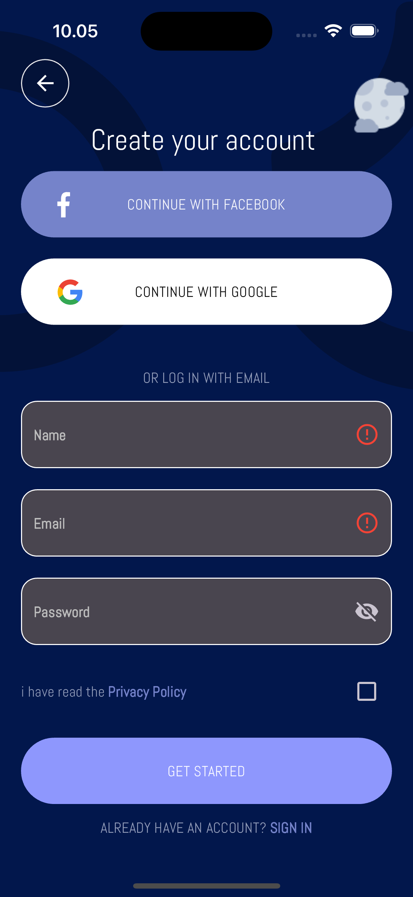
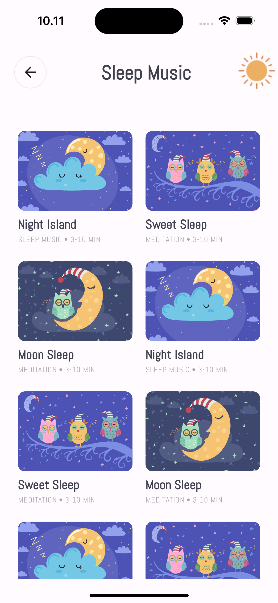
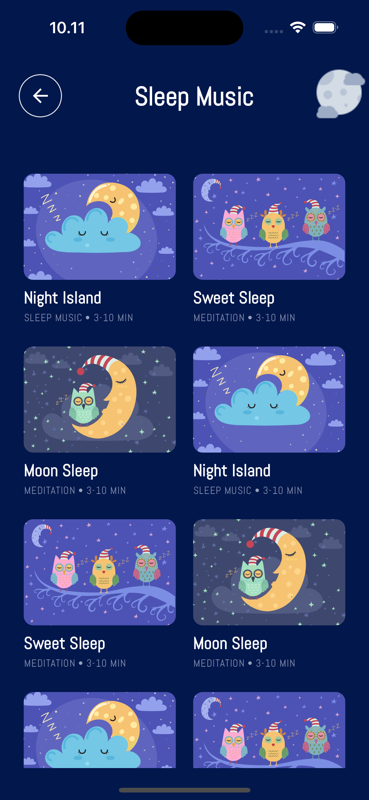

<p align="center">
    
    
    
</p>

# Flutter Meditation App UI

Flutter Meditation App UI is a mobile application built using Flutter. This project is a result of slicing a design created in Figma, with a focus on a modern and responsive user interface to deliver an optimal user experience.

## 🎨 Design

The design of this application is based on the provided Figma file. The slicing process was carried out meticulously to ensure the application accurately represents the design.

Source: [Figma File by Afsar](https://www.figma.com/community/file/882888114457713282)

## 🚀 Feature

- **Responsive Design**: Supports various screen sizes with responsive UI elements.
- **Dark & Light Theme**: Provides both dark and light modes for a more comfortable user experience.
- **Seamless Navigation**: Implements navigation using Flutter Navigator.
- **Reusable Components**: Modular components for easier development and maintenance.

## 🛠️ Technologies

This project is built using the following technologies:

- **[Flutter](https://flutter.dev/)**: A framework for cross-platform application development.
- **[Dart](https://dart.dev/)**: The primary programming language for Flutter.
- **[Google Fonts](https://fonts.google.com/)**: For custom font integration.
- **[Figma](https://www.figma.com/)**: Used as the application's design reference.

## 📂 Folder Structure  

```plaintext
.
├── assets/              # Contains images, icons, and other assets  
├── lib/  
│   ├── config/          # Application configuration (theme, routes, etc.)  
│   ├── screens/         # Main application pages  
│   ├── widgets/         # Reusable UI components  
│   ├── main.dart        # Main application file  
└── pubspec.yaml         # Flutter project configuration  
```

## 🖼️ Screenshot

| Light Theme                                    | Dark Theme                                     |
| ---------------------------------------------- | ---------------------------------------------- |
|  |  |
|  |  |
|  |  |
|  |  |
|  |  |
|  |  |
|  |  |
|  |  |
|  |  |
|  |  |
|  |  |
|  |  |
|  |  |


## Disclaimer

The design of this application is based on a free Figma template available on the Figma Community. All rights to the original design belong to the respective creator. This implementation is for learning and non-commercial purposes only.