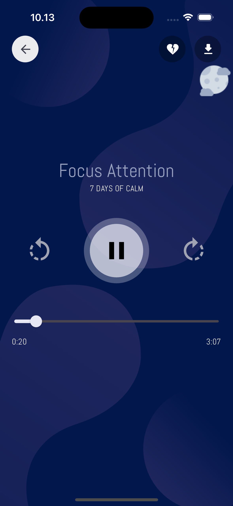

# Flutter Meditation App UI

Flutter Meditation App UI adalah aplikasi mobile yang dibuat menggunakan Flutter. Proyek ini merupakan hasil slicing dari desain yang dibuat di Figma, dengan fokus pada tampilan antarmuka yang modern dan responsif untuk mendukung pengalaman pengguna yang optimal.

## 🎨 Desain

Desain aplikasi ini dibuat berdasarkan file Figma yang telah disediakan. Slicing dilakukan secara detail untuk memastikan aplikasi merepresentasikan desain dengan akurat.

## 🚀 Fitur Utama

- **Desain Responsif**: Mendukung berbagai ukuran layar dengan elemen antarmuka yang responsif.
- **Dark & Light Theme**: Mendukung mode gelap dan terang untuk pengalaman pengguna yang lebih nyaman.
- **Navigasi Mulus**: Implementasi navigasi menggunakan Flutter Navigator.
- **Komponen Reusable**: Komponen dibuat modular untuk mempermudah pengembangan dan pemeliharaan.

## 🛠️ Teknologi

Proyek ini dibangun dengan teknologi berikut:

- **[Flutter](https://flutter.dev/)**: Framework untuk pengembangan aplikasi lintas platform.
- **[Dart](https://dart.dev/)**: Bahasa pemrograman utama untuk Flutter.
- **[Google Fonts](https://fonts.google.com/)**: Untuk integrasi font kustom.
- **[Figma](https://www.figma.com/)**: Sebagai referensi desain aplikasi.

## 📂 Struktur Folder

```plaintext
.
├── assets/              # Berisi gambar, ikon, dan aset lainnya
├── lib/
│   ├── config/          # Konfigurasi aplikasi (theme, routes, dll.)
│   ├── screens/         # Halaman utama aplikasi
│   ├── widgets/         # Komponen UI reusable
│   ├── main.dart        # File utama aplikasi
└── pubspec.yaml         # Konfigurasi proyek Flutter
```

## 🔧 Instalasi

1. Clone repository ini:

   ```bash
   git clone https://github.com/username/flutter_meditation_app.git
   cd flutter_meditation_app
   ```
2. Install dependencies:

   ```bash
   flutter pub get
   ```
3. Jalankan aplikasi:

   ```bash
   flutter run
   ```

## 🖼️ Screenshot

| Light Theme                                    | Dark Theme                                     |
| ---------------------------------------------- | ---------------------------------------------- |
|  |  |
|  |  |
|  |  |
|  |  |
|  |  |
|  |  |
|  |  |
|  |  |
|  |  |
|  |  |
|  |  |
|  |  |
|  |  |

## 📝 Lisensi

Proyek ini dilisensikan di bawah [MIT License](LICENSE).

---

🎉 **Selamat mengembangkan!** Jika Anda memiliki pertanyaan, jangan ragu untuk menghubungi kami.
